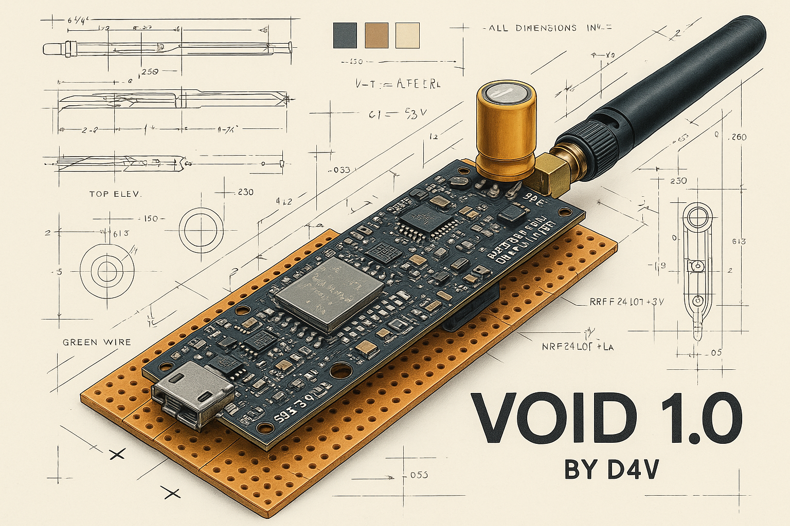
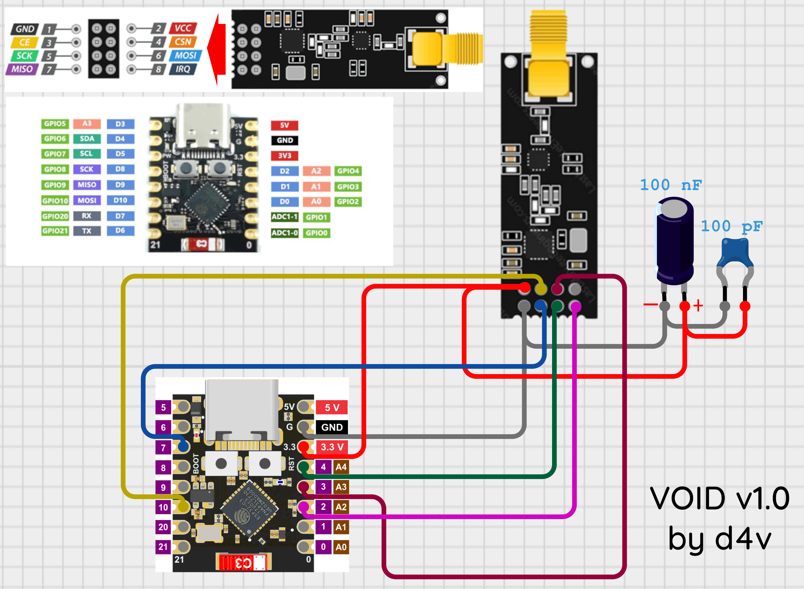
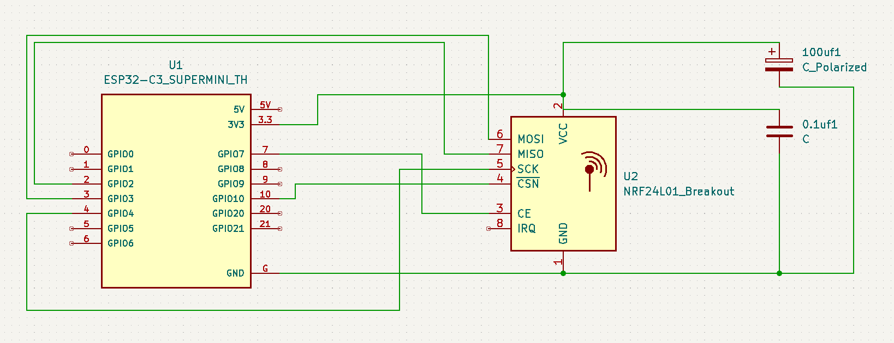
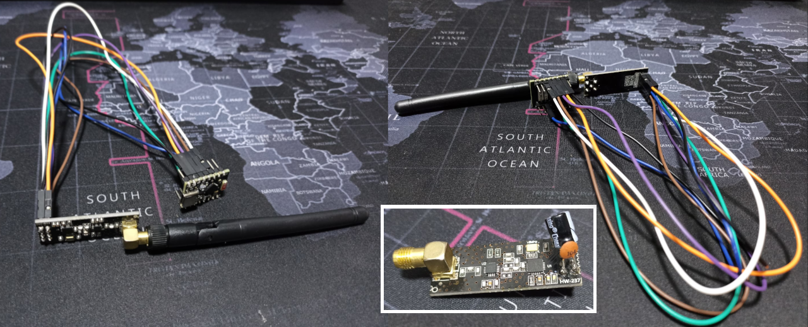
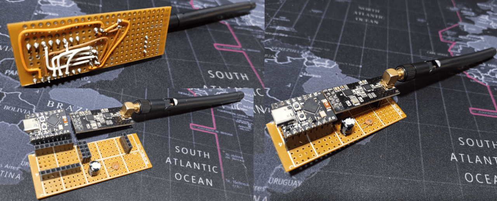

# Void - ESP32 Jammer

 
Project "void": Jammer based on ESP32 and nRF24L01 module that generates interference in the Bluetooth spectrum (2.4 GHz). Designed for educational purposes in controlled environments. It is expected to evolve to include additional functionalities such as WiFi jamming and deauthentication attacks.

 
 

### 🚀 Description

This project uses an ESP32-C3 along with an NRF24L01 module to generate interference within the Bluetooth frequency range (2.4 GHz). It is configured to randomly change the transmission channel, allowing it to cover a larger portion of the frequency spectrum. This type of device is commonly used in stress tests and studies on the robustness of wireless communication networks.

 > **This code is designed to be used in controlled environments and for educational purposes only.**

 

## 📡 Test Results (Approximate Ranges)

- **Outdoor (line of sight):**
  - Complete disruption: ~15–20 m  
  - Strong interference: Up to ~100 m (actual range likely higher; limited by test conditions)

- **Indoor / with obstacles:**
  - Complete disruption: ~6–9 m  
  - Strong interference: ~15–20 m  

> **Note:** All measurements are approximate and may vary depending on the environment and type of obstacles.

 

## ⚙️ Features

- *Module used*: NRF24L01
- *Microcontroller*: ESP32-C3
- *Communications*: SPI
- *Channels*: Randomization within Bluetooth channels (2-79)
- *License*: Apache 2.0
- *Transmission power*: Maximum (RF24_PA_MAX)
- *Data rate*: 2 Mbps (for higher interference)
- *Functionality*: Continuous signal emission to interfere with Bluetooth communications

 

## 🧩 Components

- *Hardware*:
    - ESP32-C3
    - nRF24L01 module
    - Antenna (to maximize range)

 

## 📦 Requirements

- *Hardware*:
    - ESP32 SuperMini C3 - [Suggestion](https://es.aliexpress.com/item/1005006866893910.html?spm=a2g0o.productlist.main.14.15074e02aMxnuA&algo_pvid=ee60378a-6629-49b3-bd98-00d8e42b0568&algo_exp_id=ee60378a-6629-49b3-bd98-00d8e42b0568-13&pdp_ext_f=%7B%22order%22%3A%22105%22%2C%22eval%22%3A%221%22%7D&pdp_npi=6%40dis%21PEN%219.66%218.99%21%21%2119.07%2117.74%21%402101efeb17561358986907960e4d48%2112000038607730069%21sea%21PE%213752707069%21X%211%210%21n_tag%3A-29919%3Bd%3Af93ec1d%3Bm03_new_user%3A-29895&curPageLogUid=0jsQLDIMA5aJ&utparam-url=scene%3Asearch%7Cquery_from%3A%7Cx_object_id%3A1005006866893910%7C_p_origin_prod%3A "Suggestion")
    - NRF24L01+PA+LNA - [Suggestion](https://es.aliexpress.com/item/1005007279570381.html?spm=a2g0o.detail.pcDetailTopMoreOtherSeller.6.bc6cCO63CO63cp&gps-id=pcDetailTopMoreOtherSeller&scm=1007.40050.354490.0&scm_id=1007.40050.354490.0&scm-url=1007.40050.354490.0&pvid=a096f612-d4be-446f-bde5-c7f7a9d0aa39&_t=gps-id:pcDetailTopMoreOtherSeller,scm-url:1007.40050.354490.0,pvid:a096f612-d4be-446f-bde5-c7f7a9d0aa39,tpp_buckets:668%232846%238112%231997&pdp_ext_f=%7B%22order%22%3A%222330%22%2C%22eval%22%3A%221%22%2C%22sceneId%22%3A%2230050%22%7D&pdp_npi=6%40dis%21PEN%218.29%213.60%21%21%2116.36%217.11%21%402101c59117561363844331250e0cb0%2112000040046385117%21rec%21PE%21%21ABXZ%211%210%21n_tag%3A-29910%3Bd%3A8e7a8034%3Bm03_new_user%3A-29895%3BpisId%3A5000000174217456&utparam-url=scene%3ApcDetailTopMoreOtherSeller%7Cquery_from%3A%7Cx_object_id%3A1005007279570381%7C_p_origin_prod%3A "Suggestion")
    - 100 µF electrolytic capacitor, ≥25 V (bulk decoupling) [Suggestion](https://es.aliexpress.com/item/1005002524973878.html?spm=a2g0o.productlist.main.7.6e496106y9PaWN&algo_pvid=5f6faba3-0113-4449-a1da-6d24b3bbeeb8&algo_exp_id=5f6faba3-0113-4449-a1da-6d24b3bbeeb8-6&pdp_ext_f=%7B%22order%22%3A%227465%22%2C%22eval%22%3A%221%22%7D&pdp_npi=6%40dis%21PEN%215.05%215.05%21%21%219.96%219.96%21%402103010b17561470353303475e316e%2112000020995893445%21sea%21PE%213752707069%21X%211%210%21n_tag%3A-29919%3Bd%3Af93ec1d%3Bm03_new_user%3A-29895&curPageLogUid=9O7tyifiaUuL&utparam-url=scene%3Asearch%7Cquery_from%3A%7Cx_object_id%3A1005002524973878%7C_p_origin_prod%3A "Suggestion")
    - 0.1 µF (100 nF) ceramic capacitor, ≥16 V (bypass/decoupling) [Suggestion](https://es.aliexpress.com/item/1005006579533330.html?spm=a2g0o.productlist.main.18.285dJ05vJ05v1z&aem_p4p_detail=202508251140332948572475038320000400708&algo_pvid=26d861fa-cdbb-4a53-89bb-e3bcd0558d55&algo_exp_id=26d861fa-cdbb-4a53-89bb-e3bcd0558d55-15&pdp_ext_f=%7B%22order%22%3A%22105%22%2C%22eval%22%3A%221%22%7D&pdp_npi=6%40dis%21PEN%210.91%210.84%21%21%210.25%210.23%21%402101c72a17561472336977116e1fc0%2112000037720340796%21sea%21PE%213752707069%21X%211%210%21n_tag%3A-29919%3Bd%3Af93ec1d%3Bm03_new_user%3A-29895&curPageLogUid=NuVZuTLzoLTe&utparam-url=scene%3Asearch%7Cquery_from%3A%7Cx_object_id%3A1005006579533330%7C_p_origin_prod%3A&search_p4p_id=202508251140332948572475038320000400708_4 "Suggestion")
    - Breadboard, Dupont jumper wires female to female or PCB

- *Software*:
    - Main file: [void_v1.ino](ino/void_v1.ino)
    - Arduino IDE (compilation & flashing to ESP32) [Download](https://www.arduino.cc/en/software/)

 

## 💻 Installation

**Option 1 - Compilation & Flashing to ESP32**:
https://youtu.be/MzxhSr0fRP8

 

## 🛠️ Hardware Assembly

### Pin Connection Guide for ESP32-C3 and NRF24L01

| **NRF24L01 Pin** | **ESP32-C3 Pin** | **Function**                  |
|------------------|------------------|------------------------------|
| **VCC**          | **3.3V**         | Power Supply                 |
| **GND**          | **GND**          | Common Ground                |
| **CE**           | **GPIO7**        | Module Enable                |
| **CSN**          | **GPIO10**       | SPI Chip Select (CSN)        |
| **SCK**          | **GPIO4**        | SPI Clock (SCK)              |
| **MOSI**         | **GPIO3**        | SPI Master Out Slave In      |
| **MISO**         | **GPIO2**        | SPI Master In Slave Out      |

 

### Capacitors

The **NRF24L01** module experiences consumption spikes that the **ESP32** may not handle, causing instability. Capacitors help by providing additional energy during these spikes.

- **Electrolytic Capacitor**: Delivers a larger, slower energy burst.
- **Ceramic Capacitor**: Delivers a smaller, faster energy burst.

Using both capacitors ensures stable power delivery, enhancing the **NRF24L01 module's** performance.

 

### Schematic

 

## 📸 Gallery
Prototype setup using wires

 

Prototype setup using PCB prototype board (Directly soldered or via male-female header pins for removable modules)

